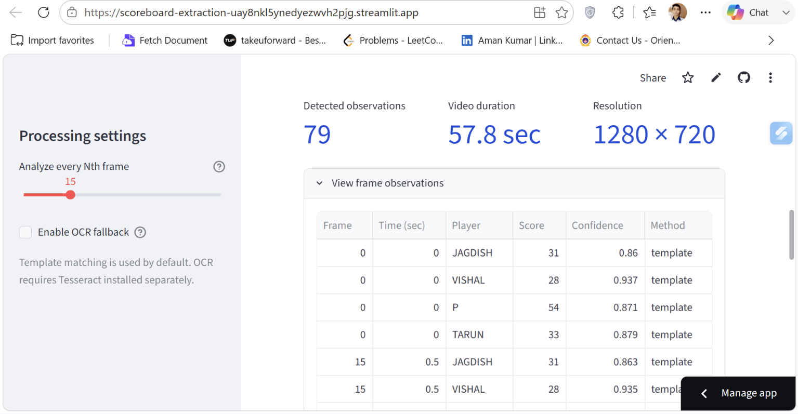
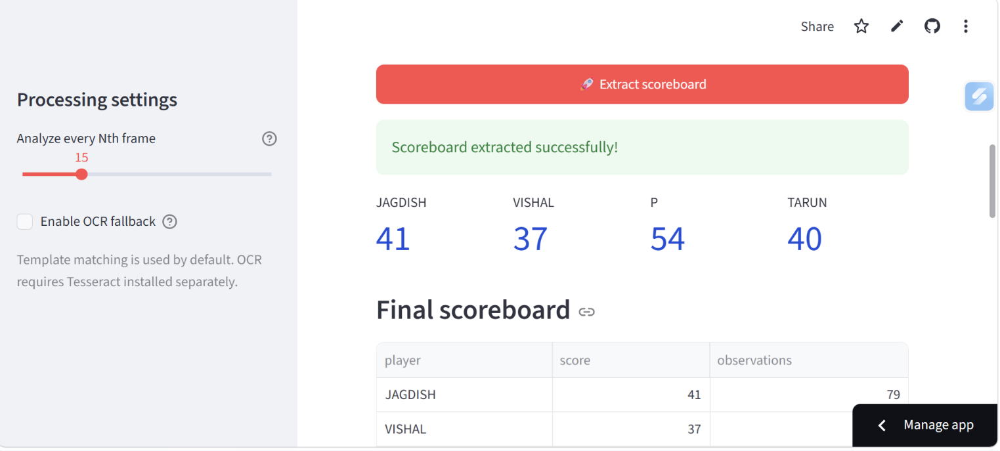
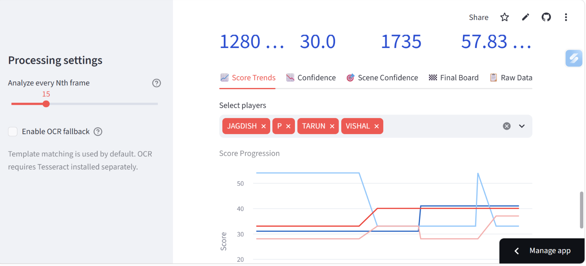
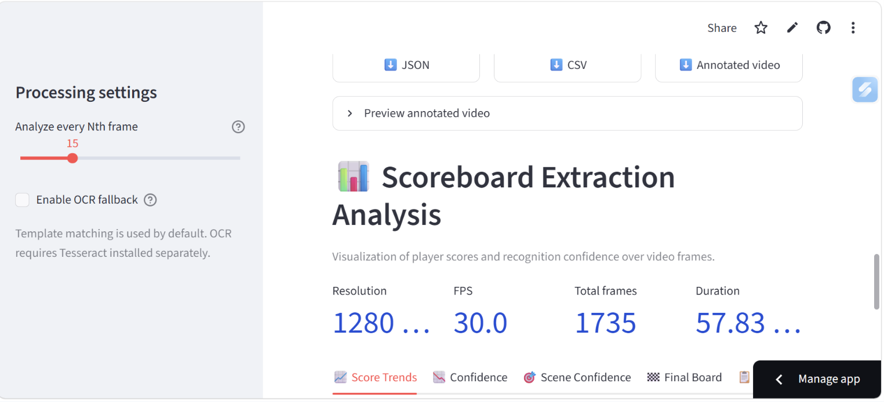
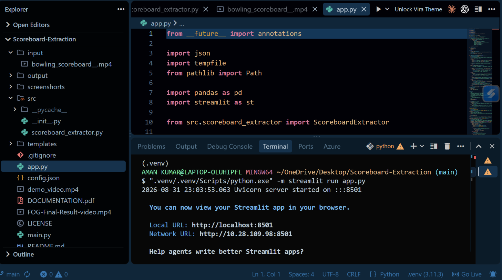

# 🎳 Computer Vision Scoreboard Extraction

Bowling scoreboard detection and score extraction from video, created by **Aman Kumar**.

This project reads bowling videos, detects scoreboard frames, extracts player scores with computer vision, validates readings across time, and exports structured results. It includes a command-line application and an interactive Streamlit web interface.

## 🌐 Try Online

**[Launch Live Demo → Scoreboard Vision · Streamlit](https://scoreboard-extraction-uay8nkl5ynedyezwvh2pjg.streamlit.app/)**

No installation required! Upload a bowling scoreboard video and extract scores instantly.

## Features

- OpenCV video decoding and configurable frame sampling.
- Blue/yellow HSV-based scoreboard scene detection.
- Resolution-independent scoreboard and score-cell cropping.
- Image preprocessing with masking, morphology, connected components, cropping, and normalization.
- OpenCV reference-template matching for score recognition.
- Optional Tesseract OCR fallback when template confidence is low.
- Temporal consensus using the highest cumulative score per player.
- JSON, CSV, and annotated MP4 output.
- Default video loaded from `input/bowling_scoreboard__.mp4`.
- Optional upload of MP4, MOV, AVI, MKV, or WebM videos.
- Analytics dashboard for score trends, recognition confidence, scene confidence, final board, and raw observations.
- Download buttons for JSON, CSV, and annotated video.

## 📸 Screenshots

### Input Video


### Frame Detection


### Score Extraction


### Analytics Dashboard


### Observations


### Application Code


## Sample result

The bundled video currently produces:

| Player | Final score |
| --- | ---: |
| JAGDISH | 41 |
| VISHAL | 37 |
| P | 54 |
| TARUN | 40 |

## Technology stack

| Area | Technology |
| --- | --- |
| Programming language | Python 3.11+ |
| Video processing | OpenCV (`opencv-python`) |
| Image processing | OpenCV and NumPy |
| Primary recognition | OpenCV normalized template matching |
| OCR fallback | Tesseract through `pytesseract` |
| Web UI | Streamlit |
| Dashboard data and charts | pandas and Streamlit native charts |
| Configuration | JSON (`config.json`) |
| Exports | JSON, CSV, annotated MP4 |

## Processing pipeline

```text
Video input
    ↓
Frame sampling
    ↓
Blue/yellow scoreboard scene detection
    ↓
Score-cell cropping and image preprocessing
    ↓
Template matching
    ↓
Optional Tesseract OCR fallback
    ↓
Temporal validation and cumulative-score consensus
    ↓
JSON + CSV + annotated video
```

A valid observation must contain at least three readable player scores. The extractor collects multiple observations instead of trusting a single blurry or noisy frame. Since bowling scores are cumulative, the maximum valid score observed for each player is selected as the final score.

## Project structure

```text
Computer-Vision-Scoreboard-Extraction/
├── app.py                         # Streamlit upload and analytics UI
├── main.py                        # Command-line entry point
├── config.json                    # Players, ROIs, thresholds, score range
├── requirements.txt               # Python dependencies
├── README.md
├── LICENSE                        # MIT License
├── input/
│   └── bowling_scoreboard__.mp4   # Default input video
├── templates/                     # Reference score images
├── src/
│   ├── __init__.py
│   └── scoreboard_extractor.py    # Core extraction pipeline
├── output/                        # Generated results
├── screenshorts/                  # Demonstration screenshots
├── demo_video.mp4
├── FOG-Final-Result-video.mp4
└── DOCUMENTATION.pdf
```

## 🚀 Getting Started

### Clone the Repository

```bash
git clone https://github.com/yourusername/Scoreboard-Extraction.git
cd Scoreboard-Extraction
```

Replace `yourusername` with your actual GitHub username.

## Installation

Create and activate a virtual environment, then install the requirements:

```bash
# Create virtual environment
python -m venv .venv

# Activate virtual environment
# On Windows:
.venv\Scripts\activate
# On macOS/Linux:
source .venv/bin/activate

# Install dependencies
python -m pip install -r requirements.txt
```

This workspace may use a nested environment. If `streamlit` is not found, use the configured interpreter explicitly:

```bash
".venv/.venv/Scripts/python.exe" -m pip install -r requirements.txt
```

## 💻 Run the Application

### Option 1: Run the Streamlit Web Application (Recommended)

```bash
streamlit run app.py
```

Or with explicit Python path:

```bash
".venv/.venv/Scripts/python.exe" -m streamlit run app.py
```

Open the local URL printed in the terminal, normally `http://localhost:8501`.

**Web App Features:**
- Default `input/bowling_scoreboard__.mp4` loads automatically
- Upload your own video (MP4, MOV, AVI, MKV, WebM)
- Adjust **Analyze every Nth frame** slider in sidebar
- Enable **OCR fallback** if needed
- Click **Extract scoreboard** to process
- View analytics dashboard with score trends, confidence charts, and final board
- Download results as JSON, CSV, or annotated MP4 video

### Option 2: Run from Command Line

```bash
python main.py --input input/bowling_scoreboard__.mp4 --output output --sample-every 15
```

**Available options:**

| Option | Description |
| --- | --- |
| `--input`, `-i` | Input video path (required) |
| `--output`, `-o` | Output directory (required) |
| `--sample-every N` | Analyze every Nth frame; default is 15 |
| `--no-video` | Skip annotated video generation |
| `--ocr-fallback` | Use Tesseract when template confidence is low |

**Example with OCR fallback:**

```bash
python main.py --input input/bowling_scoreboard__.mp4 --output output --sample-every 15 --ocr-fallback
```

### Web Application Workflow

1. The default `input/bowling_scoreboard__.mp4` is displayed automatically.
2. Optionally upload another video to override the default.
3. Adjust **Analyze every Nth frame** in the visible sidebar.
4. Enable **OCR fallback** when required.
5. Click **Extract scoreboard**.
6. Review score cards, metadata, charts, final board, and raw observations.
7. Download JSON, CSV, or the annotated video.

The sidebar is visible by default and configured to occupy approximately 30% of the viewport width.

## OCR setup

`pytesseract` is a Python wrapper; the Tesseract OCR application must also be installed. On Windows, the application automatically checks these standard paths:

```text
C:\Program Files\Tesseract-OCR\tesseract.exe
C:\Program Files (x86)\Tesseract-OCR\tesseract.exe
```

If Tesseract is installed elsewhere, add its directory to Windows PATH and restart the terminal and Streamlit. OCR is slower because each cell is tested with multiple thresholds and Tesseract page-segmentation modes.

## Configuration

`config.json` contains:

- `players`: player names and row order.
- `scoreboard_region`: normalized scoreboard bounding box.
- `total_cells`: normalized score-cell boxes.
- `score_range`: accepted numeric range.
- `detection_threshold`: minimum scene-detection score.
- `template_threshold`: minimum template-match confidence.

Normalized coordinates range from 0 to 1, allowing the configured regions to work across resolutions with the same scoreboard layout.

## Output files

Processing creates these files in `output/`:

- `scoreboard_data.json` — video metadata, extraction methods, final scores, and valid observations.
- `scoreboard_data.csv` — final player scores and observation counts.
- `detected_scoreboard.mp4` — source video annotated with the detected scoreboard and recognized scores.

JSON observations include frame number, timestamp, scene confidence, player, score, recognition confidence, method, and template name.

## Design decisions

- Recognition is restricted to the scoreboard ROI to reduce visual noise.
- Template matching is the fast primary method; OCR is an optional fallback.
- Multiple frames reduce the effect of blur, transitions, and compression artifacts.
- JSON is useful for applications, CSV is convenient for spreadsheets, and the annotated MP4 provides visual verification.

## Troubleshooting

### Video cannot be opened

Use the actual bundled filename, which contains two underscores:

```text
input/bowling_scoreboard__.mp4
```

### `streamlit: command not found`

Run Streamlit through the project interpreter:

```text
".venv/.venv/Scripts/python.exe" -m streamlit run app.py
```

### `No module named cv2` or another missing module

Install requirements using the same interpreter used to launch the application:

```text
".venv/.venv/Scripts/python.exe" -m pip install -r requirements.txt
```

### OCR does not work

Install Tesseract OCR, confirm its executable path, and restart Streamlit. The OCR checkbox enables fallback recognition; it cannot install the external Tesseract program itself.

## Limitations

- The ROIs and templates target the supplied scoreboard layout.
- Other broadcast layouts require new regions, players, and reference templates.
- The cumulative consensus assumes scores do not decrease over time.
- OCR requires an external installation and is slower than template matching.

## License

This project is released under the MIT License. See `LICENSE` for details.

## Author

**Aman Kumar**
